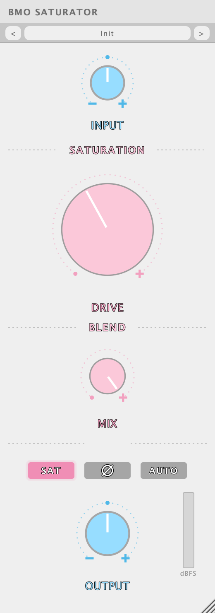

# BMO Saturator

A VST3 / AU saturator for Ableton Live, Logic, and other hosts. Part of the BMO
suite; built to a specification derived from before-and-after measurements of a
real vocal take rather than from a circuit.

The short version of what it does: an asymmetric waveshaper generates the
harmonics, and only the harmonics are filtered before being added back — so the
new energy lands in the 2.5 kHz to 18 kHz octaves while everything below stays
within a decibel of where it started, and the crest factor comes out slightly
*up*. There is no compressor, limiter, or peak reduction anywhere in it.



## Status

Builds as VST3, AU, and Standalone, and passes its own test suite. Not yet
checked by ear against the reference material, which is the only test that
finally matters — see [Verifying by ear](#verifying-by-ear).

**Downloads:** macOS (universal, VST3 + AU) and Windows (VST3) builds are
attached to each [release](https://github.com/kevkloud/bmo-saturator/releases).
Neither is code-signed yet, so both operating systems will complain the first
time — see the release notes for the two-click way past it.

## Measured

At the panel default: Drive 40 %, 2x oversampling, Auto Gain off, on a
voice-like reference signal at −18 dBFS RMS.

| | measured | Fuji target |
|---|---|---|
| positive-half average gain | 0.620 | 0.62 |
| negative-half average gain | 0.840 | 0.84 |
| **asymmetry** | **0.220** | **0.22** |
| 20 Hz – 150 Hz | −0.69 dB | −1.1 dB |
| 150 Hz – 600 Hz | +0.08 dB | −1.1 dB |
| 600 Hz – 2.5 kHz | +0.30 dB | −0.7 dB |
| **2.5 kHz – 6 kHz** | **+5.73 dB** | **+6.25 dB** |
| **6 kHz – 18 kHz** | **+8.24 dB** | **+8.25 dB** |
| crest factor change | +2.43 dB | +1.7 dB |

Second harmonic leads third by 6.3 dB at the default drive — the even-order
content that reads as warmth rather than edge.

```bash
./build/measure verify              # the table above, against both references
./build/measure verify take.wav     # the same, on a real take
./build/measure sweep               # every metric across the Drive range
./build/measure harmonics           # even against odd, by drive
```

## How it works

**The curve.** `shape(x) = (tanh(a·x + b) − tanh(b)) / a`, drive `a`, fixed
offset `b`, anti-aliased by first-order ADAA. The offset is the whole point: a
symmetric curve is an odd function and makes only odd harmonics, which is grit
and, up top, sizzle. Offsetting the operating point breaks that symmetry and
brings in even orders — second harmonic first, which is an octave and so stays
consonant with whatever produced it. `b` is held in the driven domain, so Drive
scales the curve without reshaping it: the asymmetry ratio and the even-to-odd
balance are identical at every setting and only the intensity moves.

**Where the harmonics go.** A waveshaper applied the ordinary way puts its
harmonics wherever they fall, which on a voice is mostly 600 Hz to 2.5 kHz.
The reference does the opposite — flat below 2.5 kHz, 6 to 8 dB above it — and
no single curve applied to a whole signal does that at any drive setting. So
the curve's output is split into the part that was already there and the part
it added (the residual, `shape(x) − x`), and only the residual is filtered.
Two further generators, each fed the signal below a corner and read only above
it, refill 600 Hz – 2.5 kHz and fill 2.5 kHz upwards.

That last detail matters more than it looks. The residual of a compressive
curve is not purely new harmonics: part of it is a negative copy of its input.
Amplify a full-band residual and that part subtracts the programme's own top
end, so an earlier version of this measured nearly 2 dB *darker* at 6–18 kHz
while claiming to add sheen. Generating from a band that has no top end in it
leaves nothing up there to subtract from.

**Dynamics.** The dry path through the stage is never attenuated and the added
residual is largest where the waveform moves fastest — on transients. The crest
factor therefore rises rather than falls. Nothing here follows the programme
with a level detector; Auto Gain is a fixed number per Drive setting, because
anything else would make this a compressor.

## The two references

The specification came with a target ("Fuji") and an explicit anti-target
("Preesh BG", judged harsh and sizzly by ear). Both are checked in
`tools/measure/main.cpp`, and `measure verify` warns if the result drifts
towards the second: near-zero asymmetry, or a lift confined to the top band
with nothing below it.

Three things are worth reporting back about that specification.

**The asymmetry measurement is mostly a DC measurement.** An asymmetric curve
leaves a DC offset behind — one half of the waveform is compressed and the
other is not, so the mean moves. Split the signal by polarity and compare
average gains, and what you are largely measuring is that offset. Block the DC
and the two halves come back into balance on paper while the even-order content
that actually makes the difference is untouched. This plugin blocks DC (an
offset costs headroom, thumps when the drive is automated, and accumulates
through a chain), and consequently measures 0.06 end to end where its curve
measures 0.220.

Which means **Preesh BG's 0.004 does not establish that its curve was
symmetric.** That figure is also what any DC-blocked saturator measures. If the
two references were processed by chains that differ in DC handling, this
particular number cannot tell them apart. `measure harmonics` — second and
fourth against third and fifth — is the measurement that does.

**Two different curves hit the same average gains.** A curve made asymmetric by
driving its halves at different rates fits 0.62 / 0.84 just as well as the
offset form and measures its second harmonic ~4 dB *below* its third: a
mostly-odd distortion, which is the anti-reference's character. Same asymmetry
on paper, opposite sound. Both were built here; the offset form is the one that
shipped.

**Band deltas depend heavily on the source.** How many decibels a band lifts is
a statement about how much the source already had there. The same processing
measures +5.7 dB at 2.5–6 kHz on the reference voice and +3 dB on a bare
harmonic series with more native top end. The figures above are reproducible
for the signal named; on a different take, expect the shape to hold and the
numbers to move.

One target is missed: 150 Hz – 600 Hz and 600 Hz – 2.5 kHz come out around
flat where the reference has them near −1 dB. Getting them down there means
either more compression, which costs the crest factor the reference also wants,
or a static shelf, which is a tone control this plugin does not have. Flat was
the better of the two.

## Controls

| | |
|---|---|
| **INPUT** | How hard the signal arrives at the curve. The curve is level-dependent, so this is a second drive control in everything but name. |
| **DRIVE** | Intensity, 0–100 %. The character does not change across the range — only how much of it there is. |
| **MIX** | Wet/dry, delay-matched so a partial blend cannot comb. |
| **OUTPUT** | Level. |
| **SAT** | Takes the saturation out of circuit. A true null. |
| **Ø** | Polarity. |
| **AUTO** | Static level match, so Drive can be judged on tone rather than loudness. |

No numeric readouts, by design — a plus, a minus where there is something to
subtract, and nothing else. Nothing on the panel adjusts the asymmetry or the
frequency weighting: those are the plugin rather than settings of it.

Oversampling is a parameter (Off / 2x / 4x / HQ 8x, default 2x) and reports its
latency honestly. Folded images sit at −80 dB at the default.

Past about Drive 55 the balance tips and odd harmonics lead even: it stops
being a warm saturator and becomes an overdrive. That is the top half of the
range doing what the top half of a range should, not a defect, but the
character the plugin was fitted to lives in the bottom half.

## Presets

Every factory preset measures within half a decibel of unity gain on a voice at
a working level, and a test holds them there — a preset that arrives louder
gets credit for the loudness, which is the oldest way there is to make a change
sound like an improvement.

Presets are plain files in a folder you can open:
`~/Library/Audio/Presets/LT3 Audio/BMO Saturator`. Sharing one is sending a
file.

## Building

```bash
git clone --recursive https://github.com/kevkloud/bmo-saturator.git
cd bmo-saturator
cmake -B build -DCMAKE_BUILD_TYPE=RelWithDebInfo
cmake --build build --parallel
```

A development build installs itself into `~/Library/Audio/Plug-Ins`;
`./scripts/build.sh` builds and then verifies that it actually landed, which
Live will silently prevent if it is running.

The DSP core has no JUCE dependency, so everything the plugin claims about
itself can be built and checked with no framework at all:

```bash
cmake -B build-dsp -DBMO_DSP_ONLY=ON -DCMAKE_BUILD_TYPE=Release
cmake --build build-dsp --parallel
ctest --test-dir build-dsp --output-on-failure
```

## Verifying by ear

The metrics are a strong proxy and not a substitute. To check it properly:

1. Bounce the reference vocal through the plugin at the default, Auto Gain on.
2. `./build/measure verify that-bounce.wav` for the numbers.
3. Listen against the Fuji reference file. What to listen for is whether it
   reads as *warm* rather than *bright* — the failure mode this was specified
   against measures nearly the same up top and sounds harsh.

## Licence

AGPLv3 — see `LICENSE`. JUCE is used under the AGPLv3 branch of its dual
licence. The VST3 SDK (bundled inside JUCE) is MIT-licensed.

Unlike FrostyEQ, no font files are embedded: the panel asks the system for a
sans face. That keeps an unsettled font-redistribution question out of a public
AGPL repository, at the cost of the panel not being glyph-identical across
platforms. `src/gui/Theme.cpp` is the one file that changes if the suite settles
that question.
